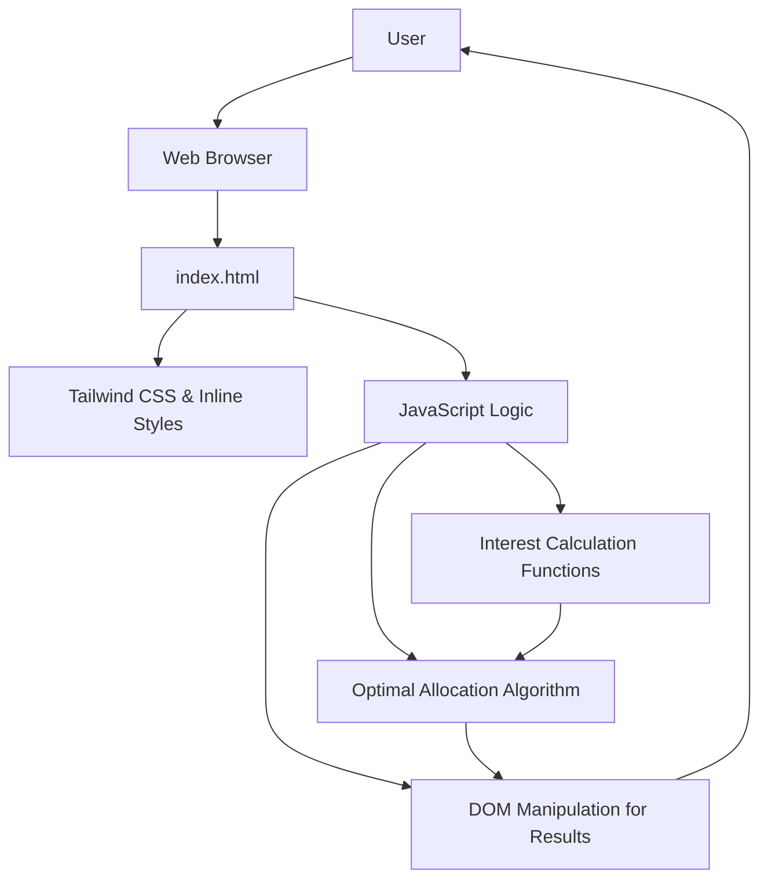

# SG Fund Allocation Optimizer

This is a personal hobby project, primarily developed with ***vibes***!

## Project Overview

The **SG Fund Allocation Optimizer** minisite is a web-based tool designed to help individuals in Singapore maximize their monthly interest earnings by calculating the optimal fund allocation across various local bank accounts (UOB, SC, DBS, CIMB). It addresses the complexity of tiered interest rates and varying bank conditions, providing clear insights and simplifying financial decisions.

## Features

*   **Total Funds Input:** Users can input their total available funds.
*   **Bank Condition Selection:** Selectable conditions for UOB, SC, and DBS accounts that influence interest rates.
*   **Optimal Fund Allocation:** Calculates the most efficient distribution of funds across the supported banks.
*   **Detailed Interest Breakdown:** Displays estimated monthly interest and a granular breakdown per bank and interest tier.

## Setup

*   **IDE:** Visual Studio Code
*   **AI Assistant:** Cline
*   **LLM:** Gemini 2.5 (utilizing a combination of Pro, Flash, and Lite models)

## Architecture

The minisite is a single-page application (SPA) built with pure HTML, CSS, and JavaScript, following a client-side architecture. All calculations and UI updates are performed directly within the user's browser, requiring no backend.

## Technologies Used

*   **HTML5:** For structuring the web content.
*   **CSS3:** For styling, primarily leveraging Tailwind CSS utility classes via CDN.
*   **JavaScript (ES6+):** For all interactive logic, calculations, and DOM manipulation. No external JavaScript libraries or frameworks are used.

## Deployment

This project is designed to be deployed as a static site on GitHub Pages [HERE]](https://alfred1137.github.io/SG-Bank-Interest-cal/). 
## License

This project is licensed under the MIT License - see the [LICENSE](LICENSE) file for details.

## Contributing

Frankly I have not a clue about how to manage community contribution. I would appreciate any suggestions but know that they will just be passed to the LLM for implementation. The chance of which it will succeed, is determined by chaos.
