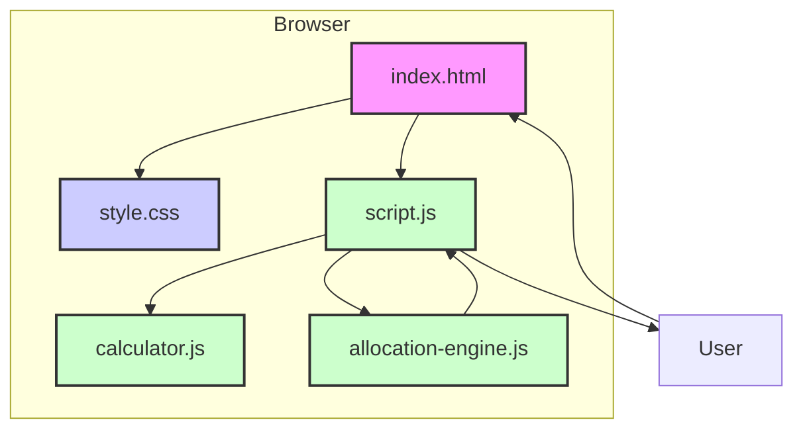

# System Patterns: SG Fund Allocation Optimizer

## 1. System Architecture

The application follows a simple **Single-Page Application (SPA)** and **Client-Side Architecture**.

-   **No Backend**: The entire application runs in the user's web browser. There is no server-side logic, database, or API. All data and calculations are handled and stored in-memory on the client-side.
-   **Static Site**: The project is deployed as a collection of static files (HTML, CSS, JavaScript) on GitHub Pages.
-   **Modularity**: The JavaScript logic is organized into modules with clear responsibilities, promoting separation of concerns.

## 2. Key Design Patterns & Concepts

### a. Modular Design

The JavaScript code is split into three main files, each with a distinct purpose:
-   `calculator.js`: The **Data Module**. It is responsible for defining the interest rate structures for each bank. It contains pure functions that take user conditions as input and return an array of interest rate tiers. This isolates the complex and frequently changing bank-specific data.
-   `allocation-engine.js`: The **Core Logic Module**. It contains the primary algorithm (`findOptimalAllocationAndInterest`) for calculating the optimal fund distribution. It is a pure function that takes the total funds and a consolidated list of all available tiers as input. It is completely decoupled from the UI and the bank-specific data structures.
-   `script.js`: The **View/Controller Module**. It handles all DOM manipulation, user input (event listeners), and orchestrates the flow of data between the UI, `calculator.js`, and `allocation-engine.js`.

### b. Greedy Algorithm

The core of the `allocation-engine.js` uses a **greedy algorithm**.
1.  **Consolidate and Sort**: It gathers all available interest rate tiers from all selected banks into a single list.
2.  **Prioritize by Rate**: It sorts this list in descending order based on the interest rate (`rate`). This ensures that funds are always allocated to the tier that provides the highest possible marginal return first.
3.  **Iterative Allocation**: It iterates through the sorted list, filling each tier to its `capacity` with the remaining funds until all funds are allocated.

This approach is highly efficient and guarantees an optimal solution because each allocation step makes the locally optimal choice (i.e., puts money where the interest rate is highest).

### c. State Management

-   **DOM as State**: The application's state is primarily managed within the DOM itself. User selections (radio buttons, checkboxes) and input values are read directly from the DOM whenever a calculation is needed.
-   **Stateless Logic**: The core calculation functions in `calculator.js` and `allocation-engine.js` are stateless and pure. They do not hold any internal state and their output depends solely on their input, making them predictable and easy to test.

## 3. Data Flow

The data flows in a unidirectional pattern:

1.  **User Input**: The user interacts with the form elements in `index.html`.
2.  **Event Trigger**: An event listener in `script.js` (e.g., `input`, `change`) fires the `updateAllocation()` function.
3.  **Data Gathering**: `updateAllocation()` reads the current values from all relevant form inputs.
4.  **Tier Generation**: It calls the respective functions in `calculator.js` to get the interest rate tiers for each selected bank based on the user's conditions.
5.  **Optimal Calculation**: It passes the total funds and the consolidated list of all tiers to `findOptimalAllocationAndInterest()` in `allocation-engine.js`.
6.  **Result Rendering**: `updateAllocation()` receives the results (allocation, interest breakdown) and updates the relevant sections of the DOM to display them to the user.
