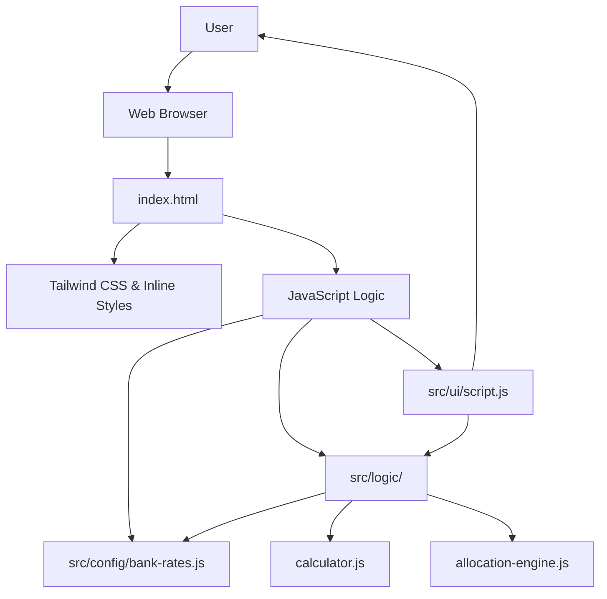

# System Patterns: Optimal Fund Allocation Minisite

## Architecture Overview
The minisite is a single-page application (SPA) implemented using HTML, CSS (Tailwind CSS), and JavaScript. It follows a client-side architecture where all logic for calculations and UI updates resides within the browser. The codebase is organized into distinct layers for configuration, business logic, and user interface.

## Key Technical Decisions
- **Frontend Framework/Library:** None. Pure HTML, CSS, and JavaScript for simplicity and minimal overhead.
- **Styling:** Tailwind CSS, managed via a local Node.js build process (`npm run build`) that compiles `src/input.css` into a static `style.css` file.
- **Testing:** Jest is used as the testing framework. Tests are located in `__tests__/` and run via `npm test`.
- **Data Storage:** No persistent data storage.
- **Backend:** No backend required.

## Design Patterns in Use
- **Separation of Concerns (MVC-lite):**
    -   **Model/Config (`src/config/`):** Stores static data like interest rates and tier structures.
    -   **Controller/Logic (`src/logic/`):** Contains pure functions for calculations (`calculator.js`) and the optimization algorithm (`allocation-engine.js`). These are decoupled from the DOM.
    -   **View/UI (`src/ui/`):** Handles DOM manipulation, event listeners, and rendering results (`script.js`).
- **Config-Driven Logic:** Interest rates and tier definitions are externalized in `src/config/bank-rates.js`. The logic functions import this configuration, making rate updates simple and less error-prone.
- **Module Pattern:** ES Modules are used throughout. `index.html` loads `src/ui/script.js` as a module.
- **Event Delegation:** UI updates are managed using event delegation on the `document` level to handle dynamic inputs and simplify event listener management.

## UI Patterns
- **Account Toggles:** Use peer-checked Tailwind classes for custom toggle switches.
- **Collapsible Conditions:** Bank-specific conditions are grouped in collapsible `div` elements, managed by the `setupConditionalVisibility` utility.
- **Status Labels:** 
    - **Last Updated:** Small italicized date next to bank names for data freshness transparency.
    - **Minimum Qualifying Requirement:** Bold, uppercase accent labels above critical baseline conditions (e.g., UOB One spend, DBS Multiplier volume).
- **Interest Breakdown Accordions:** Interactive summaries that expand to show detailed tier-by-tier interest, allocated amounts, and applicable caps.
- **`src/config/bank-rates.js`:** Exports `BANK_CONFIG` object containing all rate data.
- **`src/logic/calculator.js`:** Imports `BANK_CONFIG` and exports functions to generate tier segments for each bank.
- **`src/logic/allocation-engine.js`:** Pure logic to calculate optimal allocation given a set of tiers.
- **`src/ui/script.js`:** The entry point. Imports functions from `logic`, listens to UI events, and updates the DOM.

## Algorithmic Patterns

### Marginal Rate Allocation for Tiered Optimization

**Problem:** When allocating a single pool of funds across multiple investment options, each with its own tiered return structure, a simple greedy algorithm can fail.

**Solution:** **Marginal Rate Allocation**.

1.  **Deconstruct Tiers into Segments:** Break down every tier from every available option into a discrete "segment".
2.  **Create a Unified Pool:** Collect all segments from all options into a single list.
3.  **Sort by Marginal Rate:** Sort the list of all segments in descending order based on their `rate`.
4.  **Allocate Iteratively:** Iterate through the sorted list, allocating funds to each segment until it is full.

**Implementation:** The `findOptimalAllocationAndInterest` function in `src/logic/allocation-engine.js` implements this pattern.
