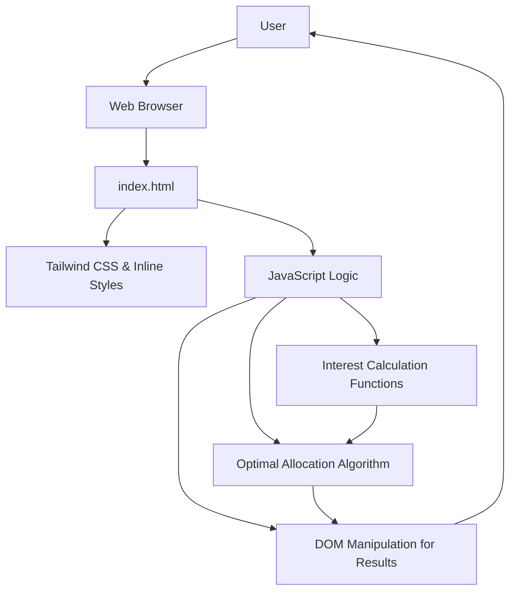

# System Patterns: Optimal Fund Allocation Minisite

## Architecture Overview
The minisite is a single-page application (SPA) implemented using HTML, CSS (Tailwind CSS), and JavaScript. It follows a client-side architecture where all logic for calculations and UI updates resides within the browser.

## Key Technical Decisions
- **Frontend Framework/Library:** None. Pure HTML, CSS, and JavaScript for simplicity and minimal overhead, suitable for a "minisite." All source code files (`index.html`, `style.css`, `script.js`) are located in the repository root for direct GitHub Pages deployment.
- **Styling:** Tailwind CSS CDN for utility-first styling, supplemented by inline CSS for specific custom styles.
- **Data Storage:** No persistent data storage (database, local storage) is used. All inputs are ephemeral and processed in real-time.
- **Backend:** No backend required. All calculations are performed client-side.

## Design Patterns in Use
- **Module Pattern (Implicit):** JavaScript functions are grouped logically (e.g., `calculateUOBInterest`, `findOptimalAllocation`) within the global scope, acting as implicit modules.
- **Event-Driven Programming:** UI updates are triggered by user input events (e.g., `input` on total funds, `change` on radio buttons).

## Component Relationships
- **HTML Structure:** Defines the layout and input fields.
- **CSS:** Styles the HTML elements for visual presentation.
- **JavaScript:**
    - Reads input values from HTML elements.
    - Contains functions for calculating interest for each bank.
    - Implements an algorithm to find the optimal fund allocation.
    - Updates the HTML DOM to display results.

## Critical Implementation Paths
- **Interest Calculation Functions:** Each bank's interest calculation logic (`calculateUOBInterest`, `calculateSCInterest`, `calculateDBSInterest`, `calculateCIMBInterest`) must accurately reflect the bank's tiered rates and conditions.
- **Optimal Allocation Algorithm (`findOptimalAllocation`):** This is the core logic that determines how funds are distributed. It must correctly identify the highest marginal interest rate at each step to ensure optimal allocation.
- **UI Update Logic:** The `updateAllocation` function is responsible for reading inputs, calling the allocation algorithm, and rendering the results dynamically.
