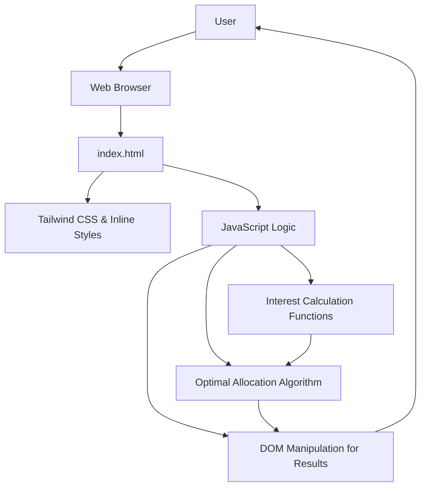

# System Patterns: Optimal Fund Allocation Minisite

## Architecture Overview
The minisite is a single-page application (SPA) implemented using HTML, CSS (Tailwind CSS), and JavaScript. It follows a client-side architecture where all logic for calculations and UI updates resides within the browser.

## Key Technical Decisions
- **Frontend Framework/Library:** None. Pure HTML, CSS, and JavaScript for simplicity and minimal overhead.
- **Styling:** Tailwind CSS, managed via a local Node.js build process (`npm run build`) that compiles `src/input.css` into a static `style.css` file. This avoids reliance on a CDN and is compatible with static hosting platforms like GitHub Pages.
- **Testing:** Jest is used as the testing framework to ensure the accuracy of the calculation logic. Tests are run via the `npm test` command.
- **Data Storage:** No persistent data storage is used. All inputs are ephemeral and processed in real-time.
- **Backend:** No backend is required. All calculations are performed client-side.

## Design Patterns in Use
- **Module Pattern:** The JavaScript code is organized into modules. `calculator.js` contains all the pure calculation logic, which is then imported and used by `script.js` for DOM manipulation and handling user events. This separation of concerns makes the code more maintainable and easier to test.
- **Event-Driven Programming:** UI updates are triggered by user input events (e.g., `input` on total funds, `change` on radio buttons), which are handled in `script.js`.

## Component Relationships
- **HTML Structure:** Defines the layout and input fields.
- **CSS:** Styles the HTML elements for visual presentation.
- **JavaScript:**
    - Reads input values from HTML elements.
    - Contains functions for calculating interest for each bank.
    - Implements an algorithm to find the optimal fund allocation.
    - Updates the HTML DOM to display results.

## Critical Implementation Paths
- **Interest Calculation Functions:** Each bank's interest calculation logic (`calculateUOBInterest`, `calculateSCInterest`, `calculateDBSInterest`, `calculateCIMBInterest`) must accurately reflect the bank's tiered rates and conditions.
- **Optimal Allocation Algorithm (`findOptimalAllocation`):** This is the core logic that determines how funds are distributed. It must correctly identify the highest marginal interest rate at each step to ensure optimal allocation.
- **UI Update Logic:** The `updateAllocation` function is responsible for reading inputs, calling the allocation algorithm, and rendering the results dynamically.

## Algorithmic Patterns

### Marginal Rate Allocation for Tiered Optimization

**Problem:** When allocating a single pool of funds across multiple investment options, each with its own tiered return structure (e.g., different interest rates for different balance amounts), a simple greedy algorithm that picks the "best" option based on an overall effective rate can fail. This is because it doesn't account for the diminishing returns once a high-yield tier is filled.

**Solution:** The optimal approach is **Marginal Rate Allocation**.

1.  **Deconstruct Tiers into Segments:** Break down every tier from every available option into a discrete "segment". Each segment has a `size` (how much funds it can hold) and a `rate` (the marginal return for funds within that segment).
2.  **Create a Unified Pool:** Collect all segments from all options into a single list.
3.  **Sort by Marginal Rate:** Sort the list of all segments in descending order based on their `rate`.
4.  **Allocate Iteratively:** Iterate through the sorted list, allocating funds to each segment until it is full, before moving to the next-best segment. Continue until all funds are allocated.

**Why it Works:** This method guarantees that every dollar is placed in the highest-yield spot available to it anywhere in the system, ensuring a globally optimal allocation. It avoids the pitfalls of the greedy approach by correctly valuing each subsequent block of investment at its true marginal return.

**Implementation in this Project:** The `findOptimalAllocation` function in `calculator.js` implements this pattern. It deconstructs the interest tiers of all banks into a single `segments` array, sorts it by rate, and then allocates the user's total funds across these segments to find the true maximum interest.
